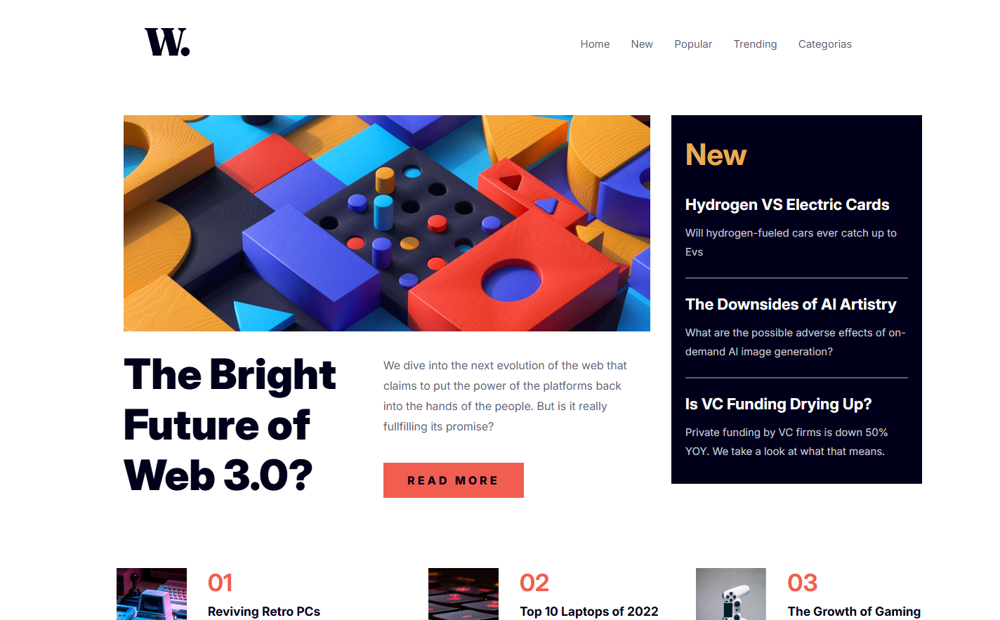

# 📝 Projeto: Página de noticiário inicial Frontend mentor



👨‍💻 **Autor:** Anderson de Souza Júnior | Desenvolvedor Fullstack (Em formação)  
💻 **Tecnologias:** VS Code, HTML5, CSS3, Flexbox e JS básico  

---

## 🎯 Objetivo

Construir um portfólio com projetos práticos de alto impacto visual e técnico,  
focando na aplicação real de **HTML5, CSS3, JS básico e Flexbox** para o mercado.

---

## 📝 Sobre o Projeto

O projeto de noticiário inicial do Frontend mentor é focado em mostrar as notíciais,
tópicos,categorias,tendências,populares e com barra lateral de notícias dinâmicas que mudam.

---

## 🛠 Correções e Atualizações

- ✅ **Layout Moderno:** Aplicação de Flexbox e boas práticas de design.  
- ✅ **Semântica e SEO:** Uso de elementos HTML5 e Meta Tags para melhor indexação.  
- ✅ **Bloco de comentários:** Bloco de comentários explicativos para código HTML/CSS/JS para implementação técnica de novas funcionalidaddes.
- ✅ **Rodapé e principal:** Foram corrigidos bugs no rodapé e principal com sucesso.

---

## 📚 Aprendizados e Desafios

- ⚠️ **Próxima Atualização:** Implementação de Javascript básico para gerar cards de notícias dinâmicas.  
- ⚠️ **Em andamento:** Ajuste de responsividade para dispositivos móveis, garantindo que o layout se adapte a qualquer tamanho de tela.  

---

## 🌐 Visualização do Projeto

🔴 **Visualização em Tempo Real:**

- 🌍 [Acessar via GitHub Pages](https://andersondesouzajrfullstack-tech.github.io/pagina-de-noticiario-inicial/)

> Permite que recrutadores explorem e testem o projeto diretamente no navegador.

---

## 💻 Como Testar o Projeto no VS Code

Siga os passos abaixo para executar o projeto localmente:

1. Clone o repositório:
   ```bash
   git clone COLE_AQUI_O_LINK_DO_SEU_REPOSITORIO

---

## ⭐ Conecte-se Comigo

- 🔗 [Meu LinkedIn](https://www.linkedin.com/in/anderson-de-souza-j%C3%BAnior-4791463b3/)
- 💻 [Meu GitHub](https://github.com/andersondesouzajrfullstack-tech/pagina-de-noticiario-inicial) 
- 📧 Meu E-mail: andersondesouzajr.fullstack@gmail.com
- 🌐 Portfólio (Em breve)

## 🧾 Minha Filosofia

> "Não aceitamos teoria sem aplicabilidade real."
